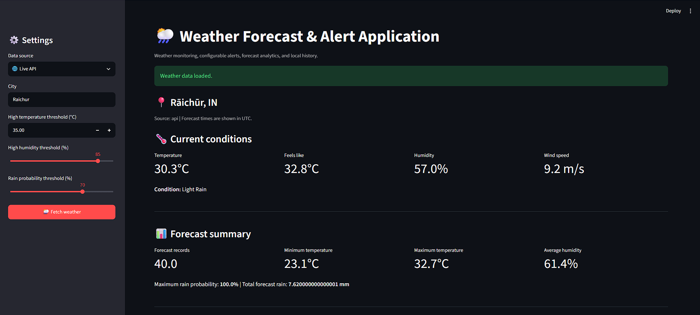
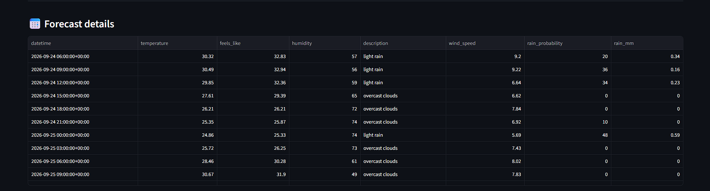
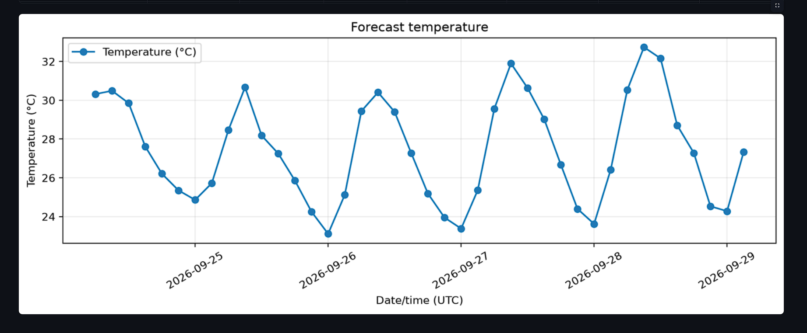
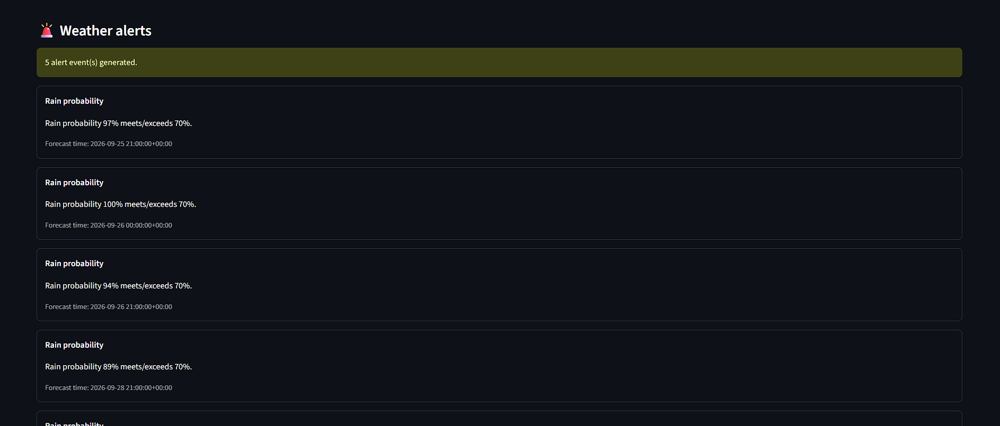

# 🌦️ Weather Forecast & Alert Application

<p align="center">
  
  
  
</p>

<h3 align="center">🌍 Your Personal Weather Intelligence & Alert System</h3>

<p align="center">
  Get weather updates, analyze forecast trends, and stay prepared with customizable weather alerts — all from one Python application.
</p>

---

## 🚀 Overview

**Weather Forecast & Alert Application** is a modular Python project designed to help users monitor weather conditions, explore forecast data, and receive alerts when weather conditions meet configured thresholds.

Whether you're planning your day, tracking temperature changes, or keeping an eye on severe weather conditions, this application brings essential weather information into one convenient place.

> 🌤️ **Stay informed. Plan smarter. Be weather-ready!**

---

## ✨ Key Features

| 🌟 Feature              | 📝 Description                                                           |
| ----------------------- | ------------------------------------------------------------------------ |
| 🌡️ Weather Forecasts   | Retrieve weather information for selected locations using a weather API. |
| 📊 Weather Analysis     | Analyze forecast data, including temperature and weather trends.         |
| 🚨 Custom Alerts        | Configure alert rules for selected weather conditions.                   |
| 🗄️ Database Support    | Store weather-related records for later access and analysis.             |
| 📧 Notifications        | Support notification workflows through configured channels.              |
| 📈 Visualizations       | Present weather data using charts and visual elements.                   |
| 📄 Reports              | Generate weather summaries and reports.                                  |
| ⏰ Scheduled Checks      | Run periodic weather checks using the scheduler module.                  |
| 🧩 Modular Architecture | Keep application logic organized into reusable Python modules.           |

---

## 🖥️ Application Preview

<p align="center">
  <b>🌦️ Forecasts • 📊 Analytics • 🚨 Alerts • 📧 Notifications</b>
</p>
 

| Dashboard | Weather forecast |
|---|---|
| |   |

| Temperature forecast | Weather Alerts |
|---|---|
|   |  |


---

## 🏗️ Project Structure

```text
Weather-Forecast-Alert-App/
│
├── src/
│   ├── __init__.py
│   ├── config.py
│   ├── weather_service.py
│   ├── analysis.py
│   ├── alert_engine.py
│   ├── database.py
│   ├── notifications.py
│   ├── reports.py
│   └── visualization.py
│
├── tests/
│   ├── test_analysis.py
│   ├── test_alert_engine.py
│   └── test_weather_service.py
│
├── app.py
├── scheduler.py
├── .env
├── .env.example
├── .gitignore
├── requirements.txt
└── README.md
```

---

## 🛠️ Built With

* 🐍 **Python** — Core application language
* 🌐 **Weather API** — Weather data retrieval
* 📊 **Data Analysis & Visualization** — Forecast insights and charts
* 🗄️ **Database** — Weather record persistence
* 🔔 **Notification System** — Configurable weather alerts
* 🧪 **Pytest** — Automated testing

---

## 🗺️ Future Enhancements

Ideas for extending the application:

* 🌩️ Severe weather alerts and notification improvements
* 📍 Multiple saved locations
* 📱 Mobile-friendly dashboard
* 🗺️ Interactive weather maps
* 📉 Historical weather comparisons
* 🌅 Sunrise and sunset information
* ☁️ Deployment to a cloud platform
* 🐳 Docker support and automated CI testing

---

## 🤝 Contributing

Contributions, suggestions, and bug reports are welcome!

1. Fork the repository.
2. Create a feature branch.
3. Make your changes.
4. Run the tests.
5. Open a pull request describing your contribution.

---

## ⭐ Support the Project

If you find this project useful:

* ⭐ Star the repository
* 🍴 Fork it and experiment
* 🐛 Report bugs or suggest features
* 📢 Share it with other Python developers

<p align="center">
  <b>🌦️ Be prepared for every forecast — one update at a time!</b>
</p>

---
